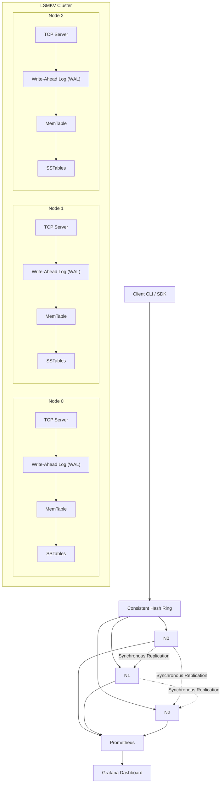
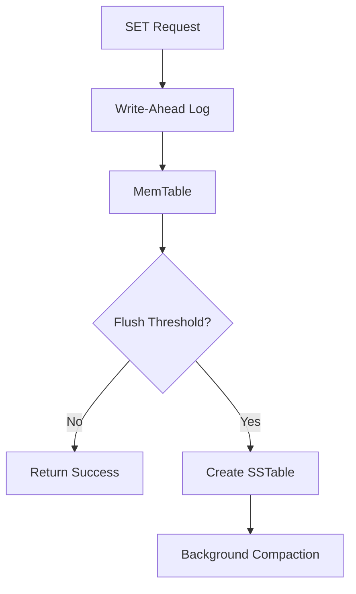
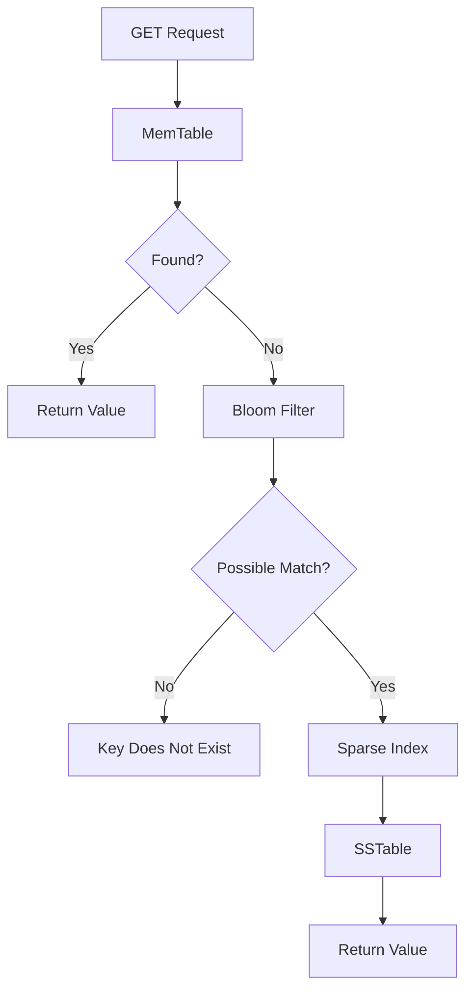
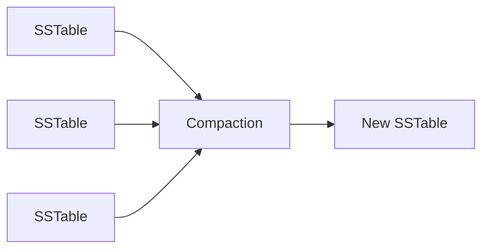
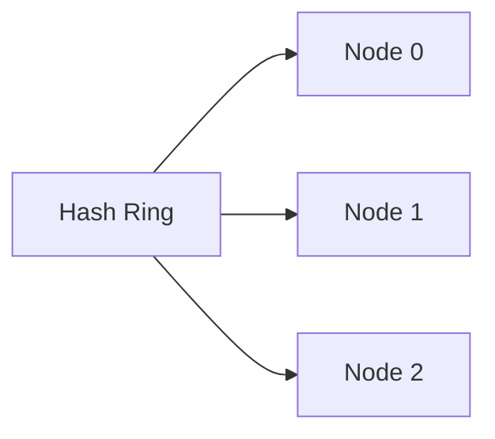
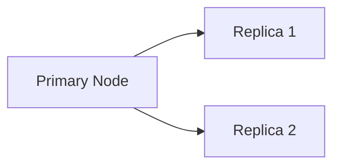
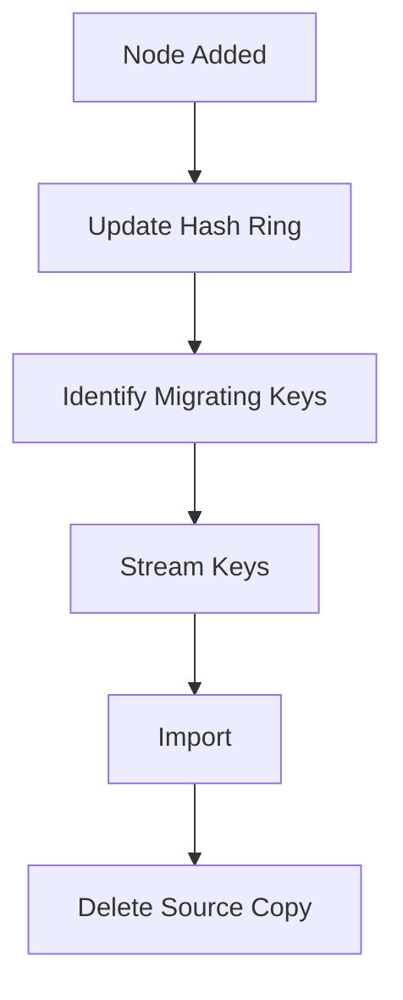

# ARCHITECTURE.md

# LSMKV Architecture

## Overview

LSMKV is a distributed Log-Structured Merge Tree (LSM Tree) based key-value database implemented entirely in Python. The system combines a custom storage engine with distributed systems concepts such as consistent hashing, synchronous replication, heartbeat monitoring, and live cluster rebalancing.

The architecture is divided into three major layers:

1. Client Layer
2. Distributed Layer
3. Storage Engine

---

# High-Level Architecture

The following diagram illustrates the overall architecture of the LSMKV distributed key-value store, including client routing, consistent hashing, storage engine components, synchronous replication, and the monitoring stack.

---

# System Components

## Client Layer

The client SDK is responsible for:

* Computing the consistent hash of every key.
* Selecting the primary node.
* Routing requests.
* Handling retries.
* Communicating using the custom MessagePack protocol.

Unlike coordinator-based systems, there is no dedicated routing server.

This design eliminates a central bottleneck while keeping request routing efficient.

---

## Distributed Layer

The distributed layer provides cluster-wide functionality.

Responsibilities include:

* Consistent hashing
* Replication
* Heartbeat monitoring
* Failure detection
* Cluster membership
* Live rebalancing
* Streaming migration

---

## Storage Engine

Every node contains an independent storage engine.

The storage engine consists of:

* Write-Ahead Log
* MemTable
* SSTables
* Bloom Filters
* Sparse Indexes
* Background Compaction

Each node persists its own data locally.

---

# Write Path

Every write follows the same sequence.

### Step 1

The client sends a SET request.

---

### Step 2

The operation is appended to the Write-Ahead Log (WAL).

This guarantees durability before acknowledging the write.

---

### Step 3

The key-value pair is inserted into the MemTable.

The MemTable is an in-memory sorted structure optimized for writes.

---

### Step 4

When the MemTable reaches its configured threshold, it is flushed to disk as an immutable SSTable.

---

### Step 5

Background compaction merges SSTables and removes obsolete entries.

---

# Read Path

Reads are optimized to minimize unnecessary disk access.

The lookup order is:

1. MemTable
2. Bloom Filter
3. Sparse Index
4. SSTables

This minimizes expensive disk reads.

---

# Write-Ahead Logging

Every mutation is recorded before modifying the MemTable.

Benefits:

* Crash recovery
* Durability
* Fast restart
* Consistent state reconstruction

If a node crashes, the WAL is replayed during startup.

---

# MemTable

The MemTable acts as the write buffer.

Characteristics:

* In-memory
* Sorted
* Mutable
* Fast writes

Once full, it is flushed into a new immutable SSTable.

---

# SSTables

SSTables are immutable sorted files stored on disk.

Advantages:

* Sequential writes
* Efficient binary search
* Easy compaction
* Simplified concurrency

Each SSTable contains:

* Sorted key-value pairs
* Sparse index
* Bloom Filter metadata

---

# Bloom Filters

Bloom Filters are probabilistic data structures used to reduce disk reads.

Before opening an SSTable, the Bloom Filter determines whether the requested key could exist.

Possible outcomes:

* Definitely not present
* Possibly present

False positives are possible.

False negatives are impossible.

---

# Background Compaction

As more SSTables accumulate, read amplification increases.

Compaction periodically:

* Merges SSTables
* Removes tombstones
* Discards obsolete versions
* Reduces read amplification

---

# Consistent Hashing

Keys are distributed using consistent hashing.

Advantages:

* Uniform distribution
* Horizontal scalability
* Minimal key movement
* Efficient node addition

---

# Replication

Writes are synchronously replicated.

The client receives success only after the configured replication factor has acknowledged the write.

Benefits:

* Improved durability
* Increased availability
* Simpler consistency guarantees

---

# Heartbeat Monitoring

Every node periodically exchanges heartbeat messages.

Heartbeat monitoring enables:

* Failure detection
* Cluster health monitoring
* Node availability tracking

Unresponsive nodes are marked offline until they recover.

---

# Live Cluster Rebalancing

When a node joins the cluster:

1. Hash ring is recomputed.
2. Ownership changes are identified.
3. Keys that no longer belong to their current owner are selected.
4. Keys are streamed to the new owner.
5. Source node deletes migrated keys.

This minimizes downtime while redistributing data across the cluster.

---

# Streaming Migration

Large migrations are transferred in batches rather than as a single payload.

Benefits:

* Lower memory usage
* Better scalability
* More reliable network transfers
* Easier recovery from failures

---

# Networking

Communication uses:

* TCP sockets
* asyncio
* MessagePack serialization

Supported operations include:

* GET
* SET
* DEL
* PING
* METRICS
* MIGRATE

---

# Monitoring

Each node exports operational metrics.

Examples include:

* Write amplification
* Read amplification
* Bloom filter hit rate
* SSTable count
* Compaction statistics
* MemTable size
* Disk usage
* Logical key count
* Active connections

Metrics are exposed to:

* CLI dashboard
* Prometheus
* Grafana

---

# Design Philosophy

LSMKV prioritizes clarity of implementation while incorporating many of the architectural principles used by production databases.

The goal is to provide a practical implementation of modern storage engine and distributed systems concepts rather than a drop-in replacement for production databases.

---

# Future Enhancements

Potential future work includes:

* Raft-based metadata coordination
* Dynamic cluster membership
* Adaptive compaction
* Read repair
* Anti-entropy synchronization
* Parallel streaming migration
* Checkpoint-based migration recovery
* Automatic cluster scaling

---

# Summary

LSMKV combines a custom LSM Tree storage engine with a distributed architecture to demonstrate the core ideas behind modern key-value databases.

Major capabilities include:

* LSM Tree storage
* Write-Ahead Logging
* Bloom Filters
* Background Compaction
* Consistent Hashing
* Synchronous Replication
* Heartbeat Monitoring
* Live Cluster Rebalancing
* Streaming Key Migration
* Prometheus Metrics
* Grafana Dashboards
* Docker-based Multi-node Deployment

Together, these components provide a practical educational implementation of a distributed storage engine inspired by the architectural principles of modern LSM-based databases.
