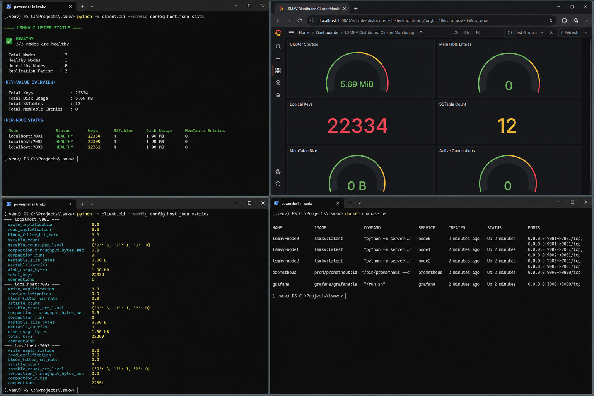
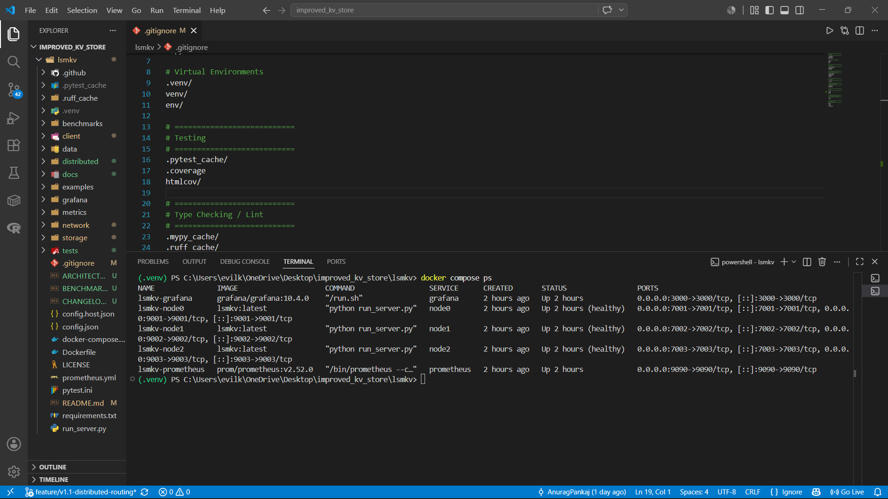
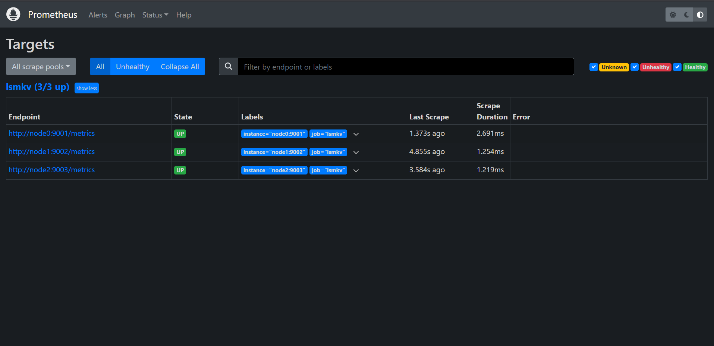
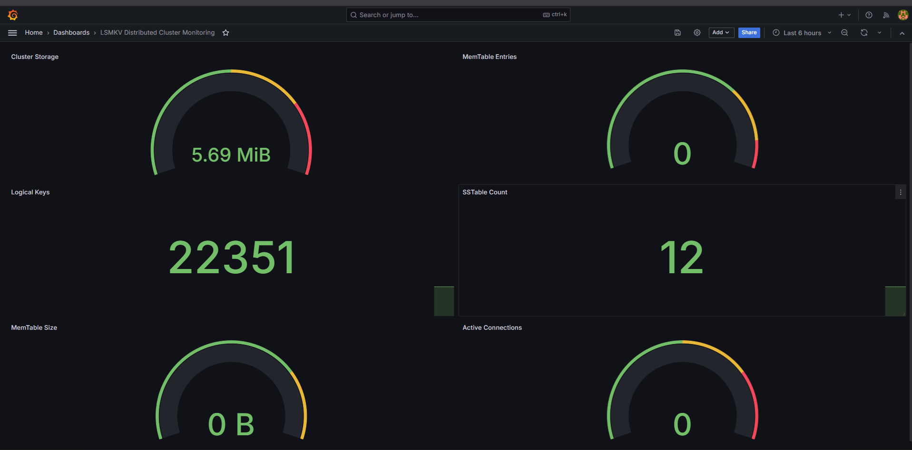
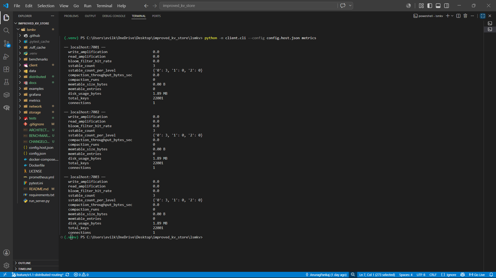
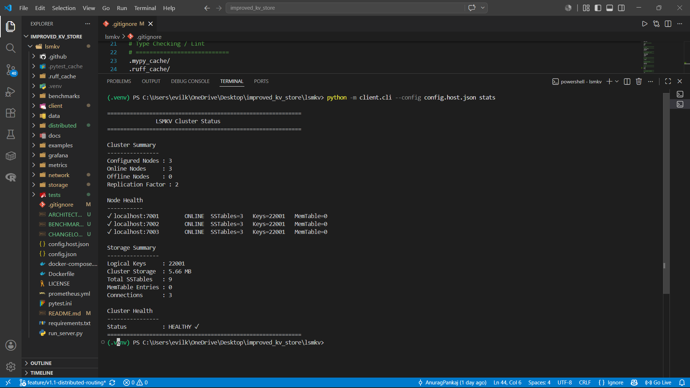
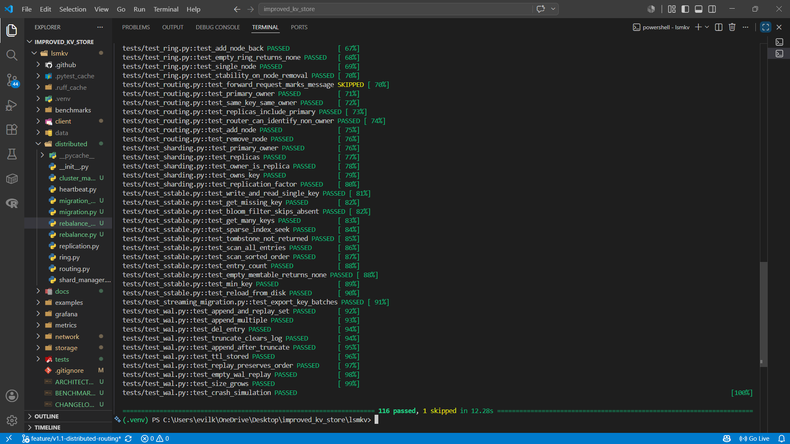

# LSMKV — Distributed LSM Tree Key-Value Store


> **LSMKV** is a production-inspired distributed key-value database built completely from scratch in Python. It implements the core concepts behind modern LSM-tree storage engines and distributed databases, including Write-Ahead Logging (WAL), MemTables, SSTables, Bloom Filters, background compaction, consistent hashing, synchronous replication, live cluster rebalancing, and streaming key migration.





---

# Project Overview

Modern databases such as **RocksDB**, **LevelDB**, **Cassandra**, and **ScyllaDB** rely on Log-Structured Merge Trees (LSM Trees) to achieve high write throughput while efficiently managing large datasets.

The primary objective of **LSMKV** is to understand and implement these storage engine concepts from first principles rather than relying on existing database libraries.

Unlike wrappers around existing databases, LSMKV implements its own storage engine and distributed layer, providing a practical demonstration of how modern distributed databases manage storage, replication, routing, and cluster coordination.

The project combines three major components:

* **Storage Engine** – LSM Tree with WAL, MemTable, SSTables, Bloom Filters, sparse indexing, and background compaction.
* **Distributed Layer** – Consistent hashing, configurable synchronous replication, heartbeat monitoring, and live cluster rebalancing.
* **Operations & Monitoring** – Docker deployment, Prometheus metrics, Grafana dashboards, and a cluster management CLI.

---

# Key Features

## Storage Engine

* Write-Ahead Logging (WAL) for crash recovery
* In-memory MemTable with TTL support
* Immutable SSTables with sparse indexes
* Bloom Filters for efficient negative lookups
* Background asynchronous compaction
* Tombstone handling and garbage collection
* Sequence-number based conflict resolution
* Automatic recovery after restart

---

## Distributed System

* Consistent hashing using virtual nodes
* Client-side request routing
* Configurable synchronous replication
* Heartbeat-based failure detection
* Live cluster rebalancing
* Streaming key migration
* Migration retry mechanism
* Dynamic ownership calculation
* Multi-node Docker deployment

---

## Observability

* Prometheus metrics endpoint
* Grafana dashboard
* Cluster health dashboard
* Human-readable CLI metrics
* Storage engine metrics
* Connection statistics

---

## Developer Experience

* Click-based command-line interface
* Asyncio networking
* Docker Compose deployment
* Comprehensive automated tests
* Modular architecture
* Production-inspired code organization

---

# Architecture Overview


```
                         +----------------------+
                         |     Client SDK       |
                         |   Consistent Hash    |
                         +----------+-----------+
                                    |
                    +---------------+---------------+
                    |               |               |
              +-----v-----+   +-----v-----+   +-----v-----+
              |  Node 0   |   |  Node 1   |   |  Node 2   |
              +-----------+   +-----------+   +-----------+
              | WAL       |   | WAL       |   | WAL       |
              | MemTable  |   | MemTable  |   | MemTable  |
              | SSTables  |   | SSTables  |   | SSTables  |
              | Bloom     |   | Bloom     |   | Bloom     |
              | Compaction|   | Compaction|   | Compaction|
              +-----------+   +-----------+   +-----------+
                    |               |               |
                    +------- Replication ----------+
                                    |
                           Prometheus Metrics
                                    |
                               Grafana Dashboard
```

### Write Path

```
SET Request
     │
     ▼
Write-Ahead Log (WAL)
     │
     ▼
MemTable
     │
     ▼
Flush Threshold Reached
     │
     ▼
Immutable SSTable
     │
     ▼
Background Compaction
```

### Read Path

```
GET Request
     │
     ▼
MemTable
     │
     ▼
Bloom Filter
     │
     ▼
Sparse Index
     │
     ▼
SSTable Lookup
     │
     ▼
Return Value
```

---

# Technology Stack

| Category         | Technology              |
| ---------------- | ----------------------- |
| Language         | Python 3.10+            |
| Networking       | asyncio                 |
| Serialization    | MessagePack             |
| Data Structures  | SortedContainers        |
| Testing          | pytest                  |
| Containerization | Docker & Docker Compose |
| Monitoring       | Prometheus              |
| Visualization    | Grafana                 |

---

# Why LSMKV?

LSMKV was designed to bridge the gap between academic concepts and production systems.

Instead of implementing a simple key-value store, the project focuses on the architectural ideas that power modern databases:

* Efficient write optimization using LSM Trees
* Durable storage through Write-Ahead Logging
* Fast lookups using Bloom Filters and sparse indexes
* Scalable data distribution with consistent hashing
* High availability through synchronous replication
* Automatic cluster rebalancing when nodes are added
* Operational visibility through metrics and dashboards

The result is a compact yet feature-rich distributed storage system that demonstrates many of the core ideas found in production-grade databases while remaining approachable enough to study and extend.

---

# Installation

## Clone the Repository

```bash
git clone https://github.com/AnuragPankaj0310/lsmkv.git

cd lsmkv
```

---

## Create a Virtual Environment

### Windows

```powershell
python -m venv .venv

.\.venv\Scripts\Activate.ps1
```

### Linux / macOS

```bash
python3 -m venv .venv

source .venv/bin/activate
```

---

## Install Dependencies

```bash
pip install -r requirements.txt
```

---

# Running LSMKV

## Single Node

Start a standalone server.

```bash
python run_server.py
```

The server starts an asyncio TCP server and initializes:

* Storage Engine
* WAL
* MemTable
* SSTables
* Background Compaction
* Metrics Endpoint

---

## Multi-Node Cluster (Docker)

Start the complete distributed cluster.

```bash
docker compose up --build
```




This launches:

* Node 0
* Node 1
* Node 2
* Prometheus
* Grafana

Verify that all services are running:

```bash
docker compose ps
```

Example:

```text
NAME                 STATUS

lsmkv-node0          Up (healthy)

lsmkv-node1          Up (healthy)

lsmkv-node2          Up (healthy)

lsmkv-prometheus     Up

lsmkv-grafana        Up
```

---

# Monitoring

## Prometheus

```
http://localhost:9090
```


---

## Grafana

```
http://localhost:3000
```

Default credentials:

```
Username : admin

Password : admin
```

(Change the password after first login if desired.)



---

# Command Line Interface

The CLI communicates directly with the distributed cluster.

General syntax:

```bash
python -m client.cli --config config.host.json <command>
```

---

## Store a Key

```bash
python -m client.cli --config config.host.json set user1 Alice
```

Output

```text
OK  user1
```

---

## Retrieve a Key

```bash
python -m client.cli --config config.host.json get user1
```

Output

```text
Alice
```

---

## Delete a Key

```bash
python -m client.cli --config config.host.json del user1
```

Output

```text
DEL user1
```

---

## Ping Cluster

```bash
python -m client.cli --config config.host.json ping
```

Example

```text
localhost:7001      PONG ✓

localhost:7002      PONG ✓

localhost:7003      PONG ✓
```

---

## Storage Engine Metrics

```bash
python -m client.cli --config config.host.json metrics
```

Example

```text
── localhost:7001 ──

Write Amplification        0.0

Read Amplification         0.0

Bloom Filter Hit Rate      0.0

SSTables                   3

Disk Usage                 1.89 MB

Logical Keys               22001

Connections                1
```

The metrics command exposes per-node storage engine statistics collected directly from the server.



---

## Cluster Dashboard

```bash
python -m client.cli --config config.host.json stats
```

Example

```text
============================================================

LSMKV Cluster Status

============================================================

Configured Nodes : 3

Online Nodes     : 3

Offline Nodes    : 0

Replication Factor : 2

Node Health

✓ localhost:7001 ONLINE SSTables=3 Keys=22001 MemTable=0

✓ localhost:7002 ONLINE SSTables=3 Keys=22001 MemTable=0

✓ localhost:7003 ONLINE SSTables=3 Keys=22001 MemTable=0

Logical Keys     : 22001

Cluster Storage  : 5.66 MB

Status           : HEALTHY ✓
```

The dashboard provides a high-level operational overview of the entire cluster, including node health, storage utilization, logical key count, and overall cluster status.



---

# Available Commands

| Command   | Description                      |
| --------- | -------------------------------- |
| `set`     | Store a key-value pair           |
| `get`     | Retrieve a key                   |
| `del`     | Delete a key                     |
| `ping`    | Check node availability          |
| `metrics` | Display storage engine metrics   |
| `stats`   | Display cluster health dashboard |

---

# Storage Metrics

Each node exports metrics including:

* Write Amplification
* Read Amplification
* Bloom Filter Hit Rate
* SSTable Count
* SSTables Per Level
* Compaction Throughput
* Compaction Runs
* MemTable Size
* MemTable Entries
* Disk Usage
* Logical Keys
* Active Connections

These metrics are available through both the CLI and the Prometheus monitoring endpoint.

---

# Project Structure

```text
lsmkv/
├── client/
│   ├── cli.py                 # Command-line interface
│   └── sdk.py                 # Client SDK & consistent hash routing
│
├── distributed/
│   ├── heartbeat.py           # Heartbeat monitoring
│   ├── migration.py           # Key migration
│   ├── rebalance.py           # Cluster rebalancing
│   ├── replication.py         # Synchronous replication
│   └── ring.py                # Consistent hashing
│
├── metrics/
│   └── prometheus.py          # Prometheus metrics endpoint
│
├── network/
│   ├── protocol.py            # MessagePack protocol
│   └── server.py              # Async TCP server
│
├── storage/
│   ├── bloom.py               # Bloom Filter
│   ├── compaction.py          # Background compaction
│   ├── engine.py              # Storage engine
│   ├── manifest.py            # Metadata management
│   ├── memtable.py            # In-memory write buffer
│   ├── sstable.py             # Immutable SSTables
│   └── wal.py                 # Write-Ahead Log
│
├── tests/                     # Unit & integration tests
├── docs/                      # Documentation
├── Dockerfile
├── docker-compose.yml
├── prometheus.yml
├── config.json
├── config.host.json
├── requirements.txt
└── run_server.py
```

---

# Testing

LSMKV includes automated unit and integration tests covering the storage engine, networking layer, distributed protocols, replication, migration, and cluster rebalancing.

Run the complete test suite:

```bash
pytest -v
```

Current status:

```text
116 passed, 1 skipped
```


The test suite covers:

* Storage engine
* WAL recovery
* MemTable operations
* SSTables
* Bloom Filters
* Compaction
* TTL handling
* Networking
* Replication
* Consistent Hashing
* Streaming Migration
* Live Cluster Rebalancing
* Docker integration

---

# Benchmarking

A benchmark utility is provided to evaluate the storage engine under different workloads.

Example:

```bash
python benchmarks/bench.py --ops 10000
```

Typical workloads include:

* Write-heavy workload
* Read-heavy workload
* Mixed read/write workload
* Random key workload

Metrics collected include:

* Operations per second
* Read latency
* Write latency
* Disk usage
* Storage growth
* Compaction statistics

> **Note:** Benchmark results depend on hardware, operating system, storage device, and workload configuration.

---

# Design Decisions

## Why LSM Trees?

LSM Trees optimize write performance by converting random disk writes into sequential writes. This makes them the preferred storage structure for many modern databases.

---

## Why Write-Ahead Logging?

Every write is first appended to the WAL before updating the MemTable.

Benefits:

* Crash recovery
* Durability
* Consistent recovery after restart

---

## Why Bloom Filters?

Bloom Filters prevent unnecessary SSTable reads.

Instead of checking every SSTable for missing keys, the Bloom Filter quickly determines whether a key could exist, significantly reducing disk I/O.

---

## Why Consistent Hashing?

Consistent hashing distributes keys evenly while minimizing data movement when nodes join or leave the cluster.

Benefits:

* Horizontal scalability
* Uniform key distribution
* Minimal key migration

---

## Why Client-side Routing?

The client SDK owns the consistent hash ring and routes requests directly to the appropriate node.

Advantages:

* No coordinator bottleneck
* Lower latency
* Simpler architecture
* Better scalability

---

## Why Synchronous Replication?

Writes are acknowledged only after replicas successfully store the data.

Advantages:

* Stronger durability
* Simpler consistency model
* Predictable failure handling

Trade-off:

* Higher write latency compared to asynchronous replication.

---

## Why Asyncio?

Networking, replication, heartbeat monitoring, and background compaction are implemented using Python's asyncio framework.

This enables efficient concurrency without relying on multiple threads for every network connection.

---

# Key Design Trade-offs

| Decision                | Benefit                   | Trade-off                     |
| ----------------------- | ------------------------- | ----------------------------- |
| LSM Tree                | High write throughput     | Read amplification            |
| Bloom Filter            | Fewer disk reads          | Additional memory             |
| Synchronous Replication | Strong durability         | Increased write latency       |
| Client-side Routing     | No coordinator bottleneck | Client maintains hash ring    |
| Background Compaction   | Better read performance   | Temporary write amplification |

---

# Interview Talking Points

When discussing the project in interviews, focus on the engineering decisions rather than simply listing features.

Highlights include:

* Built an LSM-tree storage engine completely from scratch.
* Implemented Write-Ahead Logging for crash recovery.
* Designed immutable SSTables with sparse indexing.
* Implemented a custom Bloom Filter to reduce unnecessary disk reads.
* Developed asynchronous background compaction with tombstone cleanup.
* Implemented client-side routing using consistent hashing.
* Added configurable synchronous replication.
* Built heartbeat-based failure detection.
* Implemented live cluster rebalancing using streaming key migration.
* Developed Docker-based multi-node deployment.
* Integrated Prometheus metrics and Grafana dashboards.
* Built an operational CLI for cluster monitoring.
* Wrote 116+ automated tests covering storage, networking, and distributed components.

---

# Future Work

The following improvements were intentionally left outside the scope of the current implementation.

## Distributed Coordination

* Raft consensus
* Dynamic cluster membership
* Leader election
* Automatic metadata synchronization

---

## Storage Optimizations

* Block cache
* Compression
* Prefix compression
* Adaptive compaction strategies

---

## Replication Improvements

* Checkpoint-based migration recovery
* Adaptive retry and exponential backoff
* Parallel streaming migration
* Read repair
* Anti-entropy synchronization

---

## Query Features

* Range scans
* Secondary indexes
* Transactions
* MVCC
* SQL interface

---

# Resources

## Papers

* O'Neil et al. — The Log-Structured Merge Tree (1996)
* Amazon Dynamo (2007)
* Bigtable (2006)

---

## Books

* *Designing Data-Intensive Applications* — Martin Kleppmann
* *Database Internals* — Alex Petrov

---

## Documentation

* RocksDB
* LevelDB
* Prometheus
* Grafana
* Docker

---

# Resume Project Description

> **LSMKV** is a production-inspired distributed key-value database built from scratch in Python. The project implements a custom LSM-tree storage engine featuring Write-Ahead Logging, MemTables, immutable SSTables, Bloom Filters, sparse indexing, asynchronous background compaction, configurable synchronous replication, consistent hashing, heartbeat-based failure detection, live cluster rebalancing, streaming key migration, Prometheus metrics, Grafana dashboards, Docker-based deployment, and a comprehensive automated test suite.

---

# License

This project is released under the MIT License.

---

# Acknowledgements

This project draws inspiration from the architectural ideas behind RocksDB, LevelDB, Cassandra, Bigtable, and Dynamo while remaining an independent educational implementation built entirely from scratch for learning distributed systems and storage engine internals.


---

# Demo

The following walkthrough demonstrates the major capabilities of LSMKV.

## 1. Start the Cluster

```bash
docker compose up --build
```

Verify that all services are running:

```bash
docker compose ps
```

Expected:

```text
lsmkv-node0         Up (healthy)
lsmkv-node1         Up (healthy)
lsmkv-node2         Up (healthy)
prometheus          Up
grafana             Up
```

---

## 2. Check Cluster Connectivity

```bash
python -m client.cli --config config.host.json ping
```

Expected:

```text
localhost:7001     PONG ✓
localhost:7002     PONG ✓
localhost:7003     PONG ✓
```

---

## 3. Store Data

```bash
python -m client.cli --config config.host.json set user1 Alice

python -m client.cli --config config.host.json set user2 Bob

python -m client.cli --config config.host.json set user3 Charlie
```

---

## 4. Read Data

```bash
python -m client.cli --config config.host.json get user1

python -m client.cli --config config.host.json get user2
```

Output:

```text
Alice
Bob
```

---

## 5. View Storage Metrics

```bash
python -m client.cli --config config.host.json metrics
```

Example:

```text
Write Amplification
Read Amplification
Bloom Filter Hit Rate
SSTables
Disk Usage
Logical Keys
Connections
```

---

## 6. View Cluster Dashboard

```bash
python -m client.cli --config config.host.json stats
```

The dashboard reports:

* Cluster health
* Online/offline nodes
* Replication factor
* Logical keys
* Cluster storage
* SSTable count
* MemTable entries
* Active connections

---

## 7. Open Monitoring Dashboards

Prometheus

```
http://localhost:9090
```

Grafana

```
http://localhost:3000
```

These dashboards expose storage engine and cluster metrics in real time.

---

## 8. Run the Test Suite

```bash
pytest -v
```

Current status:

```text
116 passed, 1 skipped
```

---

# Performance Characteristics

## Storage Engine

* Optimized for write-heavy workloads
* Sequential disk writes using WAL
* Immutable SSTables
* Background compaction
* Sparse indexing
* Bloom-filter-assisted lookups

---

## Distributed Layer

* Consistent hashing minimizes key movement.
* Client-side routing eliminates coordinator bottlenecks.
* Synchronous replication provides predictable durability.
* Streaming migration enables live cluster rebalancing.
* Heartbeat monitoring detects failed nodes.

---

# Repository Highlights

This project demonstrates practical implementation of:

* Distributed Systems
* Storage Engines
* Networking
* Asynchronous Programming
* Consistent Hashing
* Replication
* Failure Detection
* Background Processing
* Monitoring & Observability
* Docker-based Deployment

---

# Who This Project Is For

This repository is intended for:

* Students learning distributed systems
* Engineers exploring storage engine internals
* Interview preparation for backend and infrastructure roles
* Developers interested in LSM Trees
* Anyone studying modern database architecture

---

# Project Status

**Version:** v2.0.0

Current implementation includes:

* Custom LSM Tree storage engine
* Distributed key-value store
* Consistent hashing
* Configurable synchronous replication
* Heartbeat-based failure detection
* Live cluster rebalancing
* Streaming key migration
* Docker deployment
* Prometheus metrics
* Grafana dashboards
* Operational CLI
* Comprehensive automated testing

The project is considered **feature complete** for its educational goals. Future enhancements are documented in the *Future Work* section rather than being partially implemented.

---

# Contributing

Contributions are welcome.

If you would like to contribute:

1. Fork the repository.
2. Create a feature branch.
3. Commit your changes.
4. Add or update tests.
5. Submit a Pull Request.

Please ensure all tests pass before opening a PR.

---

# Contact

If you have questions, suggestions, or feedback, feel free to open an issue or start a discussion in the repository.

---

⭐ **If you found this project useful, consider giving it a star on GitHub.**


# Interview Demo

The following commands demonstrate the core capabilities of LSMKV using the production deployment.

## 1. Start the Cluster

```bash
docker compose up -d
```

Verify that all services are running:

```bash
docker compose ps
```

---

## 2. Check Cluster Connectivity

```bash
python -m client.cli --config config.host.json ping
```

Expected:

```
✓ localhost:7001 PONG
✓ localhost:7002 PONG
✓ localhost:7003 PONG
```

---

## 3. Store Sample Data

```bash
python -m client.cli --config config.host.json set user1 Alice
python -m client.cli --config config.host.json set user2 Bob
python -m client.cli --config config.host.json set user3 Charlie
```

---

## 4. Read Data

```bash
python -m client.cli --config config.host.json get user1
python -m client.cli --config config.host.json get user2
python -m client.cli --config config.host.json get user3
```

Expected:

```
Alice
Bob
Charlie
```

---

## 5. Delete a Key

```bash
python -m client.cli --config config.host.json del user2
python -m client.cli --config config.host.json get user2
```

Expected:

```
NOT FOUND
```

---

## 6. View Storage Metrics

```bash
python -m client.cli --config config.host.json metrics
```

Shows:

- SSTable Count
- MemTable Size
- MemTable Entries
- Logical Keys
- Disk Usage
- Active Connections
- Read/Write Amplification
- Bloom Filter Statistics

---

## 7. View Cluster Status

```bash
python -m client.cli --config config.host.json stats
```

Displays:

- Online/Offline Nodes
- Replication Factor
- Cluster Health
- Total Logical Keys
- Cluster Storage
- Total SSTables
- Active Connections

---

## 8. Observe Monitoring Dashboard

Prometheus:

```
http://localhost:9090
```

Grafana:

```
http://localhost:3000
```

Monitor:

- Logical Keys
- Cluster Storage
- SSTable Count
- MemTable Usage
- Active Connections

---

## 9. Stop the Cluster

```bash
docker compose down
```

---

## Features Demonstrated

- Distributed 3-node cluster
- Consistent hashing
- Client-side routing
- Synchronous replication
- LSM-tree storage engine
- Write-Ahead Logging (WAL)
- SSTables and background compaction
- Prometheus metrics
- Grafana dashboards
- Docker-based deployment